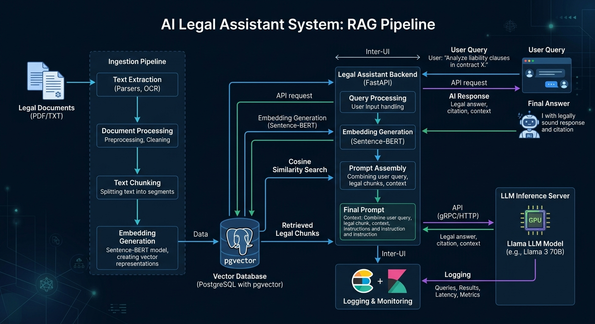

# Legal RAG Service

Production-oriented **Retrieval-Augmented Generation (RAG)** system for querying and retrieving information from legal case documents.

The system is containerized with Docker and built around **FastAPI, PostgreSQL, pgvector, sentence-transformers, and an external LLM inference service**.

## Overview

The service provides an end-to-end RAG pipeline:

* Document ingestion and text chunking
* Semantic embeddings generation
* Vector storage and similarity search with PostgreSQL + pgvector
* Context retrieval for user queries
* LLM-based response generation
* Query and source traceability through persistent logs
* REST API for integration with external applications

## Architecture



## Technology Stack

| Component        | Technology                        |
| ---------------- | --------------------------------- |
| API              | FastAPI                           |
| Database         | PostgreSQL                        |
| Vector Search    | pgvector + HNSW                   |
| Embeddings       | Sentence Transformers             |
| LLM              | TGI-compatible inference endpoint |
| Containerization | Docker / Docker Compose           |
| ORM              | SQLAlchemy                        |
| Validation       | Pydantic                          |

## Key Features

### Retrieval-Augmented Generation

The system retrieves semantically relevant document chunks using vector similarity before sending the retrieved context to the language model.

### Vector Database

PostgreSQL with **pgvector** is used as the single persistence layer for documents, chunks, embeddings, and query logs.

### Traceability

Each query stores its response and retrieved sources, providing traceability that is particularly relevant for legal-domain applications.

### External LLM Inference

The LLM is decoupled from the API service and accessed through a configurable HTTP endpoint. This allows the inference backend to run locally or on a separate GPU server.

## Configuration

Configuration is managed through environment variables using `.env`.

Example parameters include:

```env
POSTGRES_HOST=
POSTGRES_PORT=
POSTGRES_DB=
POSTGRES_USER=
POSTGRES_PASSWORD=

EMBEDDING_MODEL=
LLM_BASE_URL=
MODEL_ID=
HF_TOKEN=

TOP_K=
CHUNK_SIZE=
CHUNK_OVERLAP=
TEMPERATURE=
MAX_NEW_TOKENS=
```

Sensitive credentials and tokens are kept outside the source code.

## Running the Project

Create the environment file:

```bash
cp .env.example .env
```

Start the API and database:

```bash
docker compose up -d --build
```

If a local GPU inference service is required:

```bash
docker compose --profile llm up -d --build
```

Check the API:

```bash
curl http://localhost:8000/health
```

## Document Ingestion

Documents can be ingested from the configured data directory or uploaded through the API.

```bash
curl -X POST http://localhost:8000/api/v1/documents/ingest-folder
```

## Querying

Example request:

```bash
curl -X POST http://localhost:8000/api/v1/query \
  -H "Content-Type: application/json" \
  -d '{"query": "What is the status of case 00114-2023-0-2001-JP-FC-07?"}'
```

The API returns the generated answer together with the retrieved sources used to construct the response.

## Project Structure

```text
mi-asesor-legal/
├── app/
│   ├── routers/
│   ├── config.py
│   ├── database.py
│   ├── embeddings.py
│   ├── ingestion.py
│   ├── llm_client.py
│   ├── main.py
│   ├── models.py
│   ├── rag_service.py
│   ├── schemas.py
│   └── text_splitter.py
├── db/
│   └── init.sql
├── scripts/
│   └── ingest_cli.py
├── tests/
├── img/
│   └── architecture.png
├── Dockerfile
├── docker-compose.yml
├── requirements.txt
└── .env.example
```

## Data Access

The repository does not include the original legal-case database or document corpus due to data sensitivity and access restrictions.

If you are interested in accessing the dataset or discussing the project in more detail, please contact:

**[naybanto18@gmail.com](mailto:naybanto18@gmail.com)**
